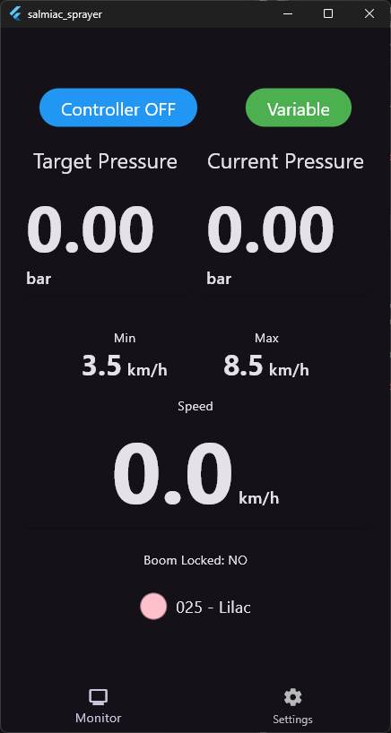

# Hardware

## Components
- Raspberry Pi 3
- Wheel angle sensor **RTY120LVNAA**. ±60 degrees
- Adafruit ADS1115 4-Channel ADC
- Adafruit 4-channel I2C-safe Bi-directional Logic Level Converter - BSS138
- BNO085 Absolute Orientation Sensor. Adafruit version is really hard to find anywhere. I used Chinese Aliexpress version. I have doubts on whether it has the same firmware.
- Cytron MD13S PWM Motor controller
- a microswitch
- 4 LED:s (and resistors).
- Motor wheel is a wire brush wheel, wires cut off, double sided mounting tape for a little cushion and hockey stick tape for a little grip. Self vulcanizing rubber tape has got a better grip, but it doesn't last very long.

## Control box

  
  

## Wheel angle sensor installation

## Steering wheel motor installation
There are some steering wheel motor designs. Two old 12 V drills and two new (cheapest I could find). 

This the latest desing. The most easiest to make, there is only one weld for the handle mount.

This is the first design. It's not bad. It's just really time comsuming to make.

This design is too weak.

## Cabin overal
Computer is a used Surface Pro 4. It is actually quite good for this purpose.

## Sprayer setup

